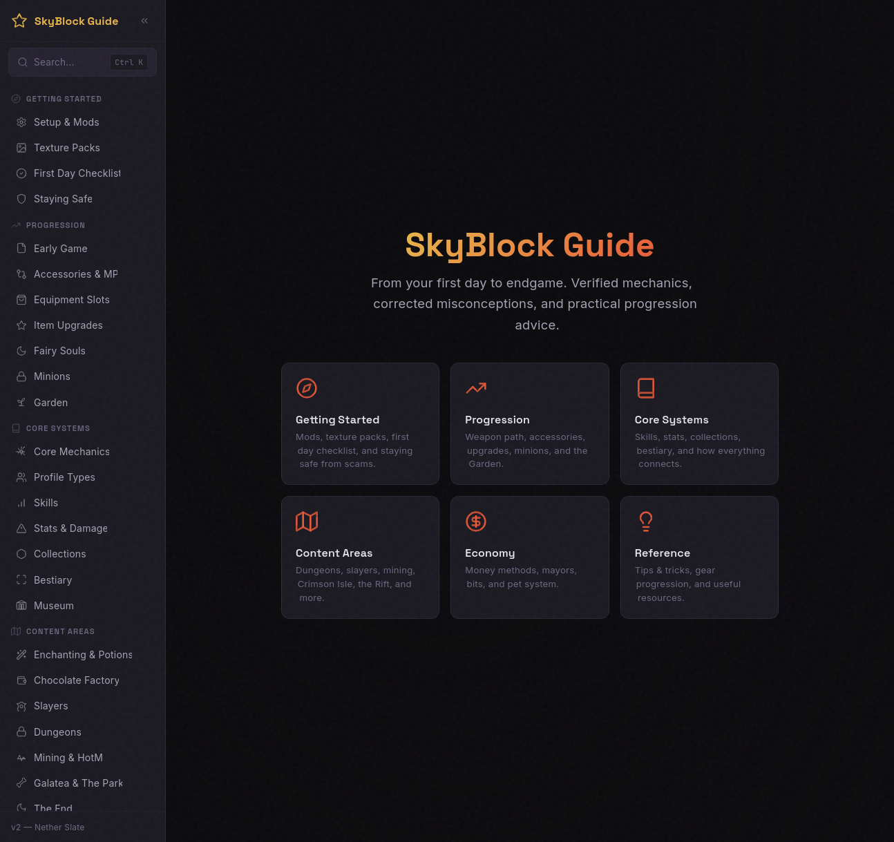

<div align="center">

# Hypixel SkyBlock Toolkit

[](https://www.python.org/)
[](https://github.com/alderban107/hypixel-skyblock#tools)
[](https://github.com/alderban107/hypixel-skyblock)
[](https://github.com/alderban107/hypixel-skyblock#license)

**Profile analysis, market pricing, and profit optimization for [Hypixel SkyBlock](https://hypixel.net/).**
<br>Pure Python. No dependencies. Live data from the Hypixel API.

</div>


## Features

- **Profile Analyzer** — 25-section breakdown with live market prices, mayor-aware recommendations, and election forecasts
- **Profit Calculators** — Unified flip scanner (craft, forge, Kat, NPC, bits) with recursive cost optimization, plus dungeon chests, slayer bosses, minion setups, and shard fusions
- **Networth Calculator** — Modifier-aware valuation across 12+ storage locations with 19 pricing handlers
- **Accessory Optimizer** — Missing accessories ranked by coins/MP with upgrade chain detection
- **SkyBlock XP Engine** — 692 tasks scored and prioritized to find your cheapest XP gains
- **Beginner Guide** — Single-page HTML guide from first day through mid-game with verified mechanics
- **AI Skill** — Drop-in `SKILL.md` that turns an AI coding assistant into a profile advisor

## Table of Contents

- [Quick Start](#quick-start)
- [Tools](#tools)
  - [Core](#core)
  - [Profit Analysis](#profit-analysis)
  - [Progression](#progression)
  - [Data & Validation](#data--validation)
- [Tool Details](#tool-details)
- [Beginner Guide](#beginner-guide)
- [AI Skill](#ai-skill)
- [Data Sources](#data-sources)
- [License](#license)

## Quick Start

```bash
git clone https://github.com/alderban107/hypixel-skyblock.git
cd hypixel-skyblock

# Set up API key (https://developer.hypixel.net/)
echo 'HYPIXEL_API_KEY=your-key-here' > .env
echo 'MINECRAFT_USERNAME=your-ign' >> .env

# Populate data sources
cd tools && python3 wiki_dump.py && cd ..
git clone https://github.com/NotEnoughUpdates/NotEnoughUpdates-REPO data/neu-repo

# Run
cd tools && python3 profile.py --full
```

Requires Python 3.9+ and a [Hypixel developer API key](https://developer.hypixel.net/). No pip packages — everything uses the standard library.

## Tools

### Core

| Tool | What it does |
|---|---|
| [`profile.py`](#profilepy) | Full profile breakdown — stats, gear, skills, mayor, market prices, upgrade suggestions |
| [`pricing.py`](#pricingpy) | Live item pricing from Bazaar + Moulberry auction APIs |
| [`networth.py`](#networthpy) | Total profile value with modifier-aware item pricing |
| [`items.py`](#itemspy) | Shared data layer — item metadata, skills, collections from Hypixel API |

### Profit Analysis

| Tool | What it does |
|---|---|
| [`flips.py`](#flipspy) | Unified flip scanner — craft, forge, kat, NPC, bits with recursive cost optimization |
| [`dungeons.py`](#dungeonspy) | Per-floor dungeon profit with chest recommendations and kismet analysis |
| [`slayers.py`](#slayerspy) | Per-tier slayer profit with RNG meter optimization |
| [`kat.py`](#katpy) | Pet upgrade chains — cost, materials, time, shopping lists |
| [`minions.py`](#minionspy) | Minion ranking by daily profit with setup cost and ROI |
| [`shards.py`](#shardspy) | Shard fusion chain advisor with market health checks |
| [`dragons.py`](#dragonspy) | End Dragon fight EV by dragon type with live drop pricing |
| [`farming.py`](#farmingpy) | Per-crop profit/hour with fortune scaling and sell method comparison |

### Progression

| Tool | What it does |
|---|---|
| [`accessories.py`](#accessoriespy) | Missing accessories ranked by coins/MP efficiency |
| [`sbxp.py`](#sbxppy) | SkyBlock XP analysis — 692 tasks prioritized by effort |
| [`museum.py`](#museumpy) | Cheapest missing museum donations |

### Data & Validation

| Tool | What it does |
|---|---|
| [`wiki_dump.py`](#wiki_dumppy) | Local mirror of the SkyBlock fandom wiki (~6,200 pages) |
| [`validate.py`](#validatepy) | Cross-validates pricing against Coflnet to flag calculation divergences |

---

## Tool Details

### `profile.py`


Fetches a player's SkyBlock profile from the Hypixel API and prints a comprehensive breakdown. Decodes base64-gzip NBT inventory blobs to extract item details (reforges, enchantments, stars, hot potato books, rarity) for every slot.

25 sections organized into core (shown by default) and extended:

| Core | Extended (`--full`) |
|---|---|
| general, dailies, mayor, skills, slayers, dungeons | collections, minions, garden, museum |
| hotm, effects, pets, inventories | rift, sacks, jacob, crystals, bestiary |
| | stats, foraging, chocolate, community, misc, crafts |

The **Mayor & Election** section cross-references active perks against a curated opportunity database (`data/mayors.json`), shows election forecasts with vote percentages, and gives prep advice for the likely next mayor — profile-aware (e.g., checks if you own a Griffin pet before recommending Diana's Mythological Ritual).

```bash
python3 profile.py                          # core sections
python3 profile.py --full                   # all 25 sections
python3 profile.py -s dungeons,collections  # specific sections
python3 profile.py --json                   # structured JSON output
```

### `pricing.py`


Real-time item pricing with automatic source selection:

1. **Bazaar API** — bulk commodity prices with spread and volume (single API call, 5-min cache)
2. **Moulberry bulk APIs** — lowest BIN, 3-day average, and sales volume for AH items (three bulk requests, 5-min cache)

```bash
python3 pricing.py POWER_WITHER_CHESTPLATE JUJU_SHORTBOW
```

Also used as a library — other tools import `PriceCache` for inline valuations.

### `networth.py`


Calculates total profile value across 12+ storage locations with 19 modifier pricing handlers (essence stars, hot potato books, enchantments, reforge stones, gemstones, master stars, scrolls, dyes, pet items, and more). Multipliers based on [SkyHelper-Networth](https://github.com/SkyHelperBot/networth)'s architecture.

Reports dual networth (total + unsoulbound). Soulbound items valued at market reference price; unpriceable items tracked separately.

<details>
<summary>Modifier pricing table</summary>

| Modifier | Multiplier | Source |
|---|---|---|
| Essence Stars (1-5) | 0.75× | Hypixel items API `upgrade_costs` + NEU `essencecosts.json` |
| Hot Potato Books (1-10) | 1.0× | `hot_potato_count` NBT |
| Fuming Potato Books (11-15) | 0.6× | `hot_potato_count` > 10 |
| Recombobulator 3000 | 0.8× | `rarity_upgrades` NBT |
| Enchantments | 0.85× | `enchantments` compound |
| Reforge Stones | 1.0× | `modifier` NBT → 75 stone mappings |
| Gemstones | 1.0× | `gems` NBT compound |
| Master Stars (6-10) | 1.0× | Stars > 5 |
| Necron Blade Scrolls | 1.0× | `ability_scroll` NBT |
| Art of War / Peace | 0.6× / 0.8× | NBT flags |
| Drill/Rod Parts | 1.0× | `drill_part_*` NBT |
| Dyes | 0.9× | `dye_item` NBT |
| Pet Candy | 0.65× | `candyUsed` field |
| Pet Held Items | 1.0× | `heldItem` field |
| Wood Singularity | 0.5× | `wood_singularity_count` NBT |
| Farming for Dummies | 0.5× | `farming_for_dummies_count` NBT |
| Etherwarp Conduit | 1.0× | `ethermerge` NBT |
| Transmission Tuners | 0.7× | `tuned_transmission` NBT |
| Mana Disintegrator | 0.8× | `mana_disintegrator_count` NBT |

</details>

```bash
python3 networth.py                    # full breakdown
python3 networth.py --category pets    # single category
python3 networth.py --top 20          # most valuable items
python3 networth.py --verbose         # list every priced item
python3 networth.py --json            # machine-readable output
```

### `items.py`

Shared data layer. Fetches and caches item metadata, skill XP tables, and collection thresholds from the three free [Hypixel API resource endpoints](https://api.hypixel.net/) (no key needed). Lazy-loaded with 1-day TTL. All other tools import from this.

```bash
python3 items.py                       # summary stats
python3 items.py shadow assassin       # search items by name
```

### `flips.py`


Unified flip scanner that finds profitable transformations across multiple flip types. Uses **recursive craft cost optimization** by default — if an ingredient is cheaper to craft than buy from the bazaar, that cascades through all recipes using it, uncovering flips that simpler tools miss.

Three output sections in the default view:
- **Instant Flips** (craft + NPC) — sorted by profit
- **Time-Gated Flips** (forge + Kat pet upgrades) — sorted by profit/hour, with duration
- **Bit Shop Value** — ranked by coins/bit

Supply/demand indicators show market state: ↑ undersupplied (sells fill fast), ↓ oversupplied (competitive), ≈ balanced, ⚠ illiquid.

```bash
python3 flips.py                          # all flip types
python3 flips.py craft                    # craft flips only
python3 flips.py forge                    # forge flips only
python3 flips.py sell-order               # bazaar sell-order flips
python3 flips.py kat                      # kat pet upgrade flips
python3 flips.py npc                      # NPC buy → market sell
python3 flips.py bits                     # bit shop value ranking
python3 flips.py --profile                # filter by player unlocks
python3 flips.py --item PERSONAL_COMPACTOR_4000  # recipe breakdown with recursive costs
python3 flips.py --no-recursive           # disable recursive costing
```

### `dungeons.py`


Per-floor dungeon profit using a per-item cost model — EV only counts items where market price exceeds the chest claim cost, matching how players actually decide which chests to open. Covers F1-F7 and M1-M7.

Includes chest breakdown with OPEN/SKIP verdicts, kismet feather analysis, RNG meter targets ranked by coins/XP, and guaranteed essence pricing.

```bash
python3 dungeons.py                    # all floors ranked by hourly rate
python3 dungeons.py --floor f6         # detailed F6 breakdown
python3 dungeons.py --floor m5         # Master Mode 5
python3 dungeons.py --json             # machine-readable output
```

### `accessories.py`


Finds missing accessories and ranks them by coins/MP efficiency. Handles 55 upgrade chains (ported from [SkyCrypt](https://github.com/SkyCryptWebsite/SkyCrypt)), aliases, unobtainable filtering, recombobulation tracking, and inactive/duplicate detection.

```bash
python3 accessories.py                 # full report
python3 accessories.py --budget 10m    # within 10M budget
python3 accessories.py --upgrades-only # only upgrade opportunities
python3 accessories.py --json          # machine-readable output
```

### `slayers.py`


Per-tier slayer profit for all 6 types. Drop data from [Luckalyzer](https://mabi.land/luckalyzer/) (precise RNG probabilities) and the fandom wiki (common drops). Includes RNG meter optimization, Magic Find modeling, Aatrox mayor bonuses, and Scavenger/Champion coin income.

```bash
python3 slayers.py                     # summary + all tier comparisons
python3 slayers.py --type zombie --tier 5
python3 slayers.py --magic-find 200
python3 slayers.py --aatrox            # apply mayor bonuses
```

### `kat.py`


Kat pet upgrade calculator. Builds full upgrade chains across rarity steps, compares buy-vs-craft for starting pets, and generates consolidated shopping lists. For the scan of all profitable Kat flips, use `flips.py kat`.

```bash
python3 kat.py RABBIT --profit         # single pet with profit analysis
python3 kat.py SKELETON --shopping     # consolidated shopping list
python3 kat.py --scan                  # → forwards to flips.py kat
```

### `minions.py`


Ranks all 57 minion types by daily profit with configurable setup (tier, fuel, compactor). Includes ROI calculation and a `--slots` mode that finds the cheapest crafts for your next minion slot unlock.

```bash
python3 minions.py                     # ranked profit table
python3 minions.py --item snow --roi   # detailed breakdown with ROI
python3 minions.py --slots             # cheapest path to next slot
```

### `sbxp.py`


Analyzes 692 individual SkyBlock XP tasks across 17 categories, cross-references your profile, and recommends the most efficient next gains. Finds affordable essence shop perks, close collection milestones, and other low-effort wins.

```bash
python3 sbxp.py                        # full analysis + recommendations
python3 sbxp.py --brief                # recommendations only
python3 sbxp.py --category mining      # filter by category
```

### `museum.py`


Ranks missing museum donations by cost. Cross-references your museum data with NEU-REPO constants and live market prices.

```bash
python3 museum.py                      # cheapest 25 missing items
python3 museum.py -n 50               # top 50
python3 museum.py --category combat   # filter by category
```

### `shards.py`


Shard fusion advisor — traces fusion chains with live pricing, ranks farmable shards by value, identifies cheapest fillers per rarity, and flags dead markets. Covers all 141 shards with wiki-verified fusion mechanics.

```bash
python3 shards.py                      # quick summary
python3 shards.py chain molthorn       # full fusion chain with prices
python3 shards.py farm                 # farmable shard rankings
python3 shards.py health               # market health check
```

### `dragons.py`


Expected value per End Dragon fight by dragon type, using [SkyHanni](https://github.com/hannibal002/SkyHanni)'s DragonLoot.json drop tables with live market pricing. Shows net profit after eye cost and highlights which dragon types are worth fighting at your eye count.

```bash
python3 dragons.py                     # all dragon types summary
python3 dragons.py --type superior     # detailed Superior Dragon breakdown
python3 dragons.py --eyes 4            # assume 4 eyes placed
python3 dragons.py --json              # machine-readable output
```

### `farming.py`


Per-crop profit calculator with farming fortune scaling. Compares NPC sell, raw bazaar sell, and enchanted bazaar sell to find the best method for each crop. Supports auto-detection of farming fortune from your profile.

```bash
python3 farming.py                     # all crops (default 100 fortune)
python3 farming.py --fortune 500       # set farming fortune
python3 farming.py --crop wheat        # detailed wheat breakdown
python3 farming.py --profile           # auto-detect fortune from profile
python3 farming.py --npc               # include NPC sell prices
python3 farming.py --json              # machine-readable output
```

### `wiki_dump.py`

Mirrors the [SkyBlock Fandom Wiki](https://hypixel-skyblock.fandom.com/) locally (~6,200 pages). Supports incremental updates and template-expanded plain text generation for grep-friendly data lookups.

```bash
python3 wiki_dump.py                   # full dump (~5 min)
python3 wiki_dump.py --update          # incremental update
python3 wiki_dump.py --parse           # generate searchable plain text
```

### `validate.py`

Cross-validates our craft, forge, Kat, and shard fusion pricing against [Coflnet](https://sky.coflnet.com/)'s independent calculations. Flags items where the two sources diverge beyond a configurable threshold — useful for catching pricing bugs or stale data.

```bash
python3 validate.py                    # run all validations
python3 validate.py --crafts           # craft profits only
python3 validate.py --forge            # forge recipes only
python3 validate.py --kat              # Kat upgrades only
python3 validate.py --fusions          # shard fusions only
python3 validate.py --threshold 30     # flag divergences >30% (default: 20%)
python3 validate.py --verbose          # show all items, not just divergent
```

## Beginner Guide



A single-page HTML guide (`guide/index.html`) covering SkyBlock from first spawn through mid-game. Open in a browser — no build step needed.

Covers mod setup (Fabric 1.21.10 + Skyblocker/SkyHanni/Firmament), all 12 skills, dungeons floor-by-floor, slayers, mining/HotM, Rift, garden, 30+ money-making methods, and gear progression tables. Interactive checkboxes track your progress across sections.

## AI Skill

The included `SKILL.md` file turns an AI coding assistant into a SkyBlock profile advisor. It instructs the AI to:

- Run the profile tools and read the output
- Cross-reference the local wiki to verify game mechanics
- Check live market prices before recommending purchases
- Give prioritized, actionable recommendations based on your actual profile data

Works with any AI coding assistant that supports skill/prompt files (tested with [Pi](https://github.com/mariozechner/pi-coding-agent) and Claude Code).

Edit the skill file to match your playstyle — add budget preferences, content you enjoy, or goals you're working toward.

## Data Sources

All data is fetched on-demand and cached locally. Nothing requires background jobs or external services beyond the APIs listed below.

| Source | Used by | Key needed |
|---|---|---|
| [Hypixel API v2](https://api.hypixel.net/) | profile, items, pricing | Yes |
| [Hypixel Resources API](https://api.hypixel.net/v2/resources/skyblock/items) | items (metadata, skills, collections) | No |
| [Hypixel Election API](https://api.hypixel.net/v2/resources/skyblock/election) | profile (mayor section) | No |
| [Moulberry Bulk APIs](https://moulberry.codes/) | pricing, crafts, networth | No |
| [Coflnet](https://sky.coflnet.com/) | forge, validate | No |
| [NEU-REPO](https://github.com/NotEnoughUpdates/NotEnoughUpdates-REPO) | recipes, essence costs, reforges, pets | Local clone |
| [SkyBlock Fandom Wiki](https://hypixel-skyblock.fandom.com/) | dungeons (loot tables), game mechanics | `wiki_dump.py` |

## License

The tools in this repository are provided as-is for personal use. Wiki content belongs to [Hypixel](https://hypixel.net/) and its contributors. NEU-REPO data belongs to the [NotEnoughUpdates](https://github.com/NotEnoughUpdates) contributors.
